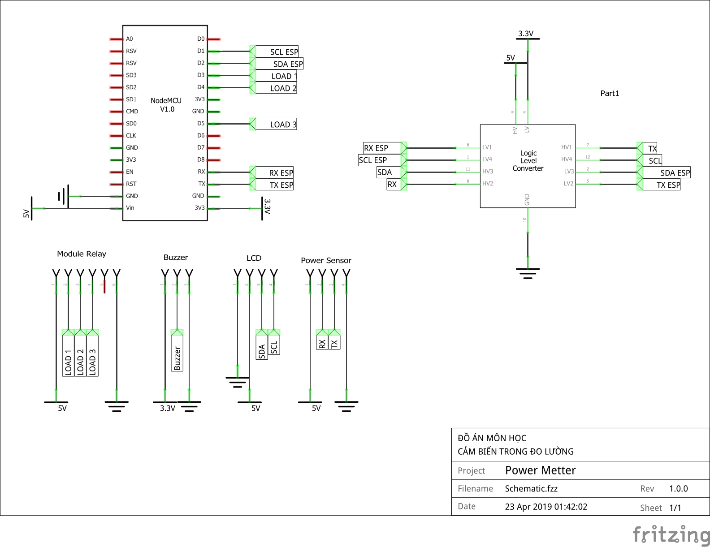

Đo điện năng tiêu thụ của thiết bị điện AC
##########################################

* **Thực hiện:**

* **Thời gian: Ngày 21 tháng 04 năm 2019**

.. sectnum::

.. contents:: Nội dung

Đo điện năng tiêu thụ của thiết bị điện AC
******************************************

Giới thiệu
==========

* Điều khiển và theo dõi điện năng tiêu thụ của thiết bị điện AC qua Internet với App Blynk:

  * Vi điều khiển: ESP8266 Node MCU 1.0.

  * App điều khiển: Blynk (Android, iOS).

  * Cảm biến điện năng: PZEM004T

  * Sử dụng Relay để điều khiển đóng, ngắt tải AC.

  * Cảnh báo quá tải.

Mạch nguyên lý
==============

Chương trình điều khiển
=======================

* File config PlatformIO: `platformio.ini <https://github.com/thiminhnhut/powermetter/blob/master/20.Firmware/platformio.ini>`_

* File `config.h <https://github.com/thiminhnhut/powermetter/blob/master/20.Firmware/src/config.h>`_

* File chương trình chính: `main.cpp <https://github.com/thiminhnhut/powermetter/tree/master/20.Firmware/src/main.cpp>`_

Giải thích hoạt động của code
=============================

* Thông tin hiển thị lên LCD trên Blynk App và LCD thật.

* Điều khiển các thiết bị thông qua các nút nhấn trên Blynk App

* Cảnh báo quá áp qua nút nhấn Buzzer (thiết bị gửi cảnh báo lên và từ App gửi cảnh báo về).

Kết quả
=======

.. * Giao diện điều khiển trên Blynk App:

.. .. image:: 30.BlynkApp/ConfigDevice.jpg
..     :width: 40%
.. .. image:: 30.BlynkApp/BlynkUI2.jpg
..     :width: 40%

.. .. image:: 30.BlynkApp/GaugeCurrent.jpg
..     :width: 30%
.. .. image:: 30.BlynkApp/GaugeVoltage.jpg
..     :width: 30%
.. .. image:: 30.BlynkApp/Slider.jpg
..     :width: 30%
.. .. image:: 30.BlynkApp/Load1.jpg
..     :width: 30%
.. .. image:: 30.BlynkApp/Load2.jpg
..     :width: 30%
.. .. image:: 30.BlynkApp/Load3.jpg
..     :width: 30%
.. .. image:: 30.BlynkApp/Buzzer.jpg
..     :width: 30%